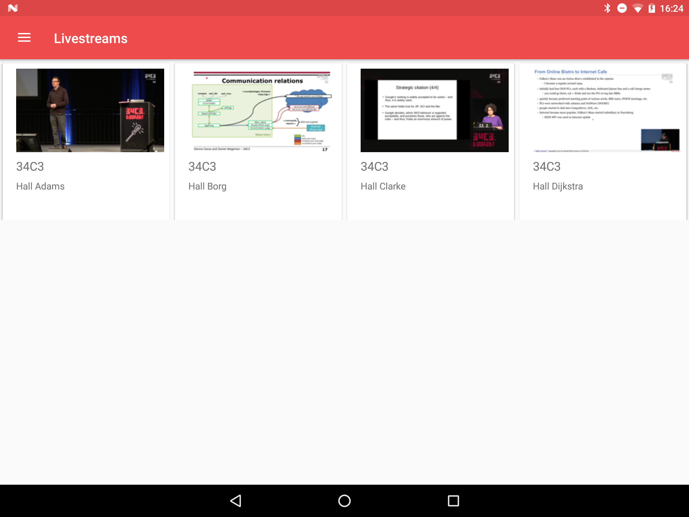
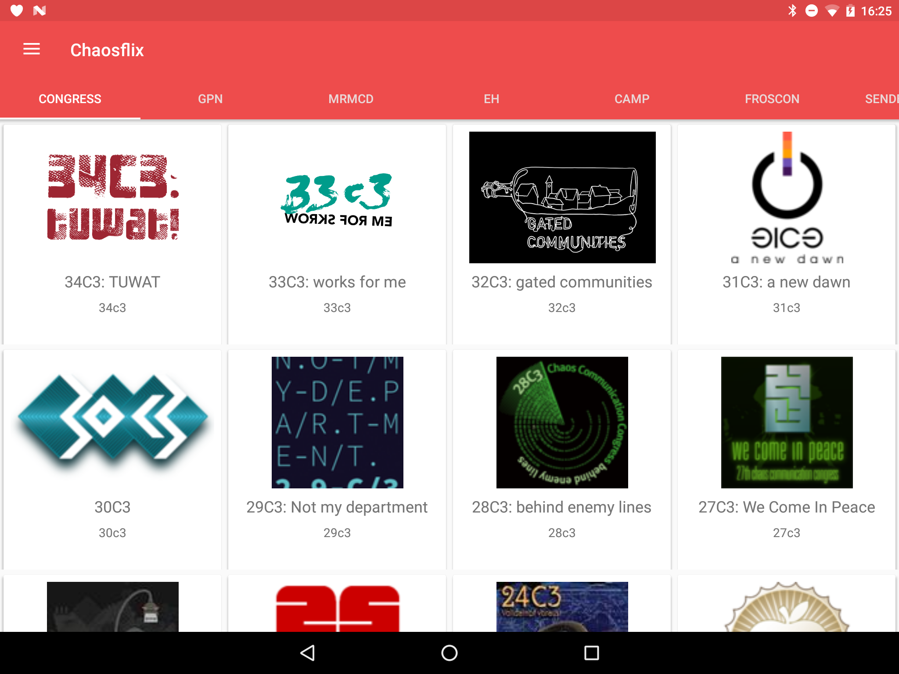
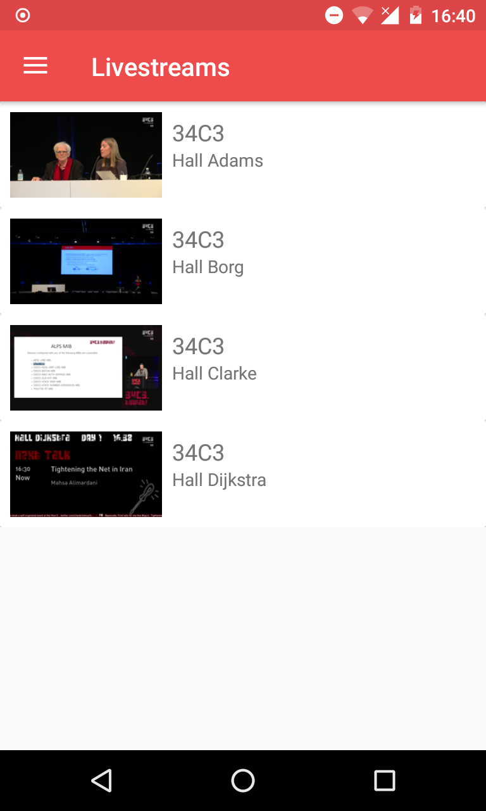

This Repo remains for continuity reasons, further development is happening in [chaosflix-common](https://github.com/NiciDieNase/chaosflix-common), [chaosflix-leanback](https://github.com/NiciDieNase/chaosflix-leanback) and [chaosflix-touch](https://github.com/NiciDieNase/chaosflix-touch).

# Chaosflix

A Android (TV) / FireTV app to watch content from media.ccc.de

You can get an APK you can install under Releases [phone/tablet](https://github.com/NiciDieNase/chaosflix-touch/releases) [TV](https://github.com/NiciDieNase/chaosflix-leanback/releases).
If you don't know how install that on your device, have a look [here](http://www.aftvnews.com/sideload/)

## Screenshots

